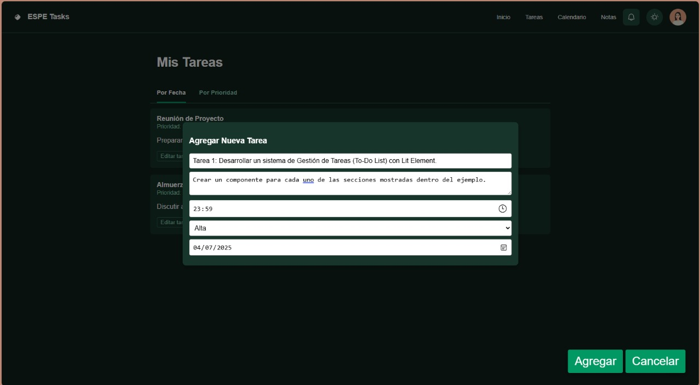
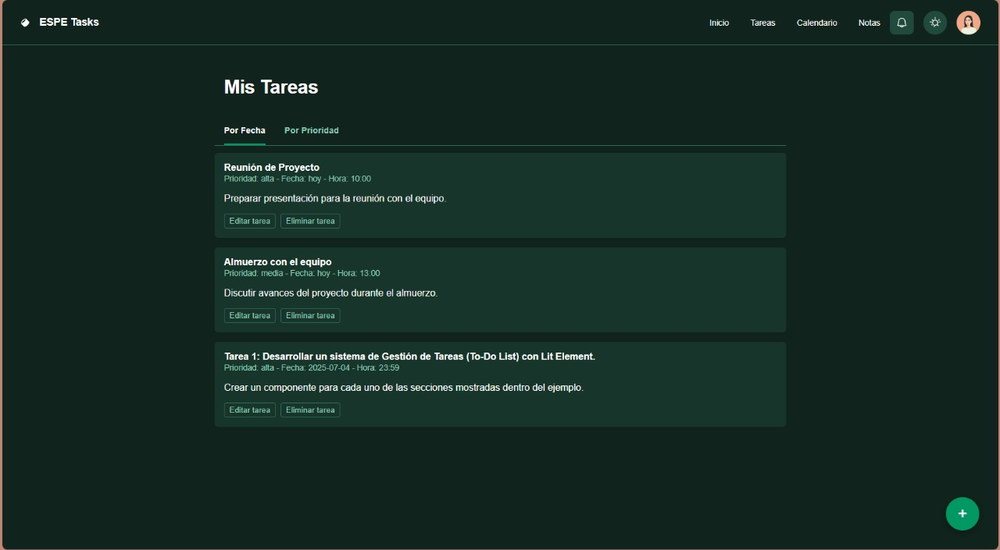
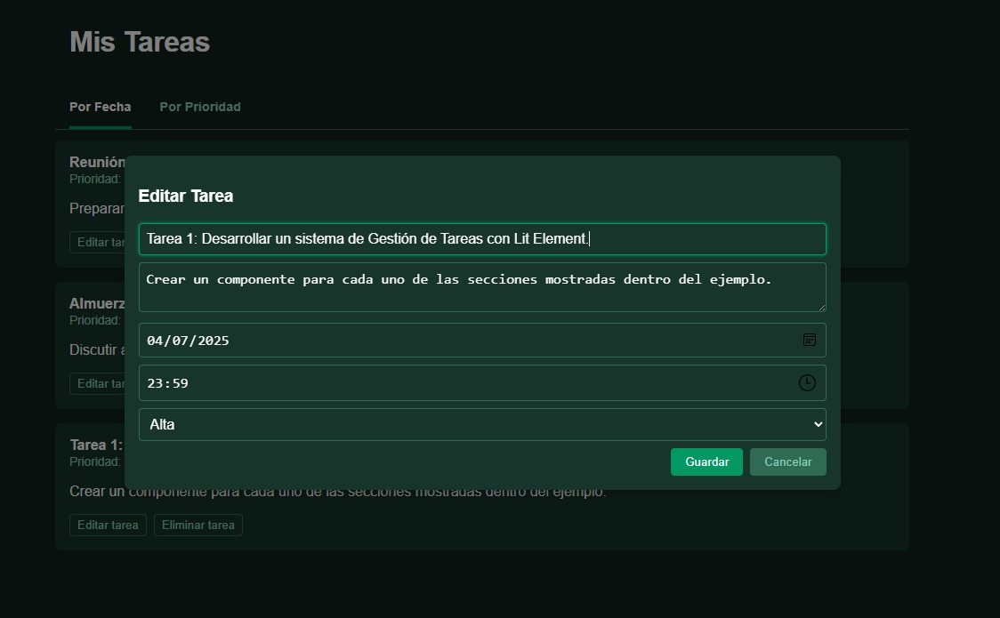
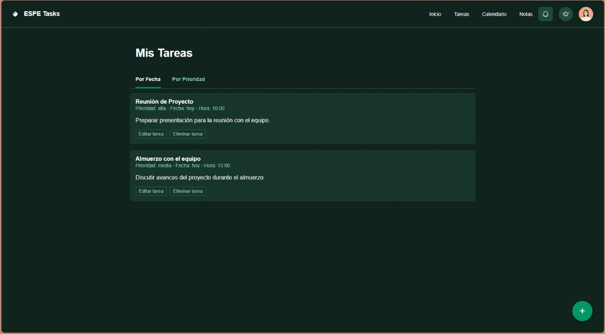
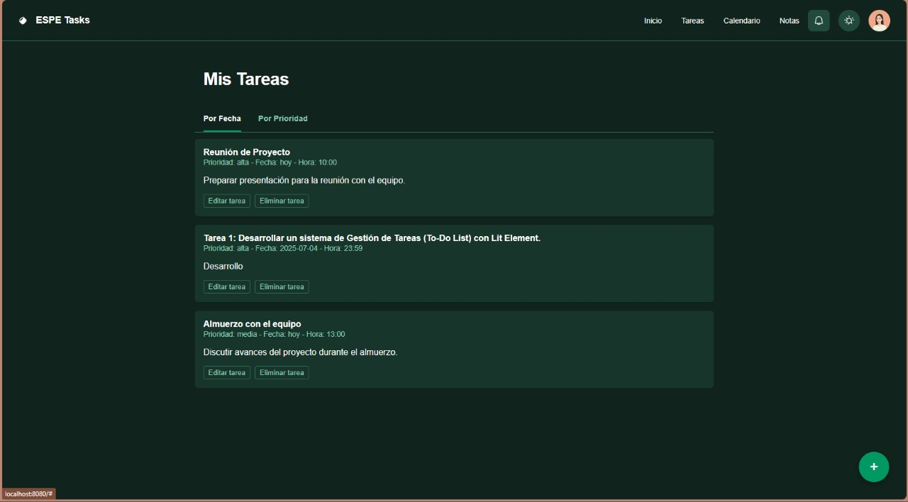

## Componentes JavaScript (`src/components/`)

### `app-container.js`
Componente raíz `<espe-app-container>`. Es el contenedor general que agrupa todos los demás componentes y gestiona el estado global de las tareas y el tema.

Funciones clave:
- Inicializa tareas predefinidas.
- Maneja eventos como `task-added`, `task-updated`, `task-deleted`.
- Cambia entre tema claro y oscuro.
- Renderiza la estructura principal de la app.

---

### `espe-task-list.js`
Componente `<espe-task-list>` que muestra las tareas activas.

Funciones clave:
- Muestra una lista de tareas con sus datos.
- Permite editar o eliminar tareas.
- Usa un modal para editar con validaciones y eventos personalizados.

---

### `espe-task-items.js`
Componente complementario para la gestión de ítems de tareas (si es necesario para descomposición futura).

Funciones clave:
- Encapsula posibles subcomportamientos o subcomponentes de tareas individuales.
- Puede usarse para fragmentar responsabilidades dentro de la lista de tareas.

---

### `espe-add-task-button.js`
Componente `<espe-add-task-button>` que muestra un botón flotante (+).

Funciones clave:
- Al hacer clic, abre un formulario para agregar una nueva tarea.
- Emite el evento `task-added` con los datos del formulario.
- Aplica estilos con transiciones, y diseño accesible y responsive.

---

### `espe-header.js`
Componente `<espe-header>` que representa la cabecera de la aplicación.

Funciones clave:
- Muestra el título o barra superior.
- Permite alternar el tema de la aplicación con un botón.
- Emite `theme-toggle` para comunicación con el contenedor principal.

---

## Instalación y ejecución del proyecto

```bash
npm install
npm run serve
```
## Evidencias de ejecución
Demostración de agregar una tarea.


Demotración de guardado en la plataforma.


Edición de la tarea.


Funcionamientod de eliminación de la interfaz


Muestra de prioridad de tareas de Alta hacia la Baja

